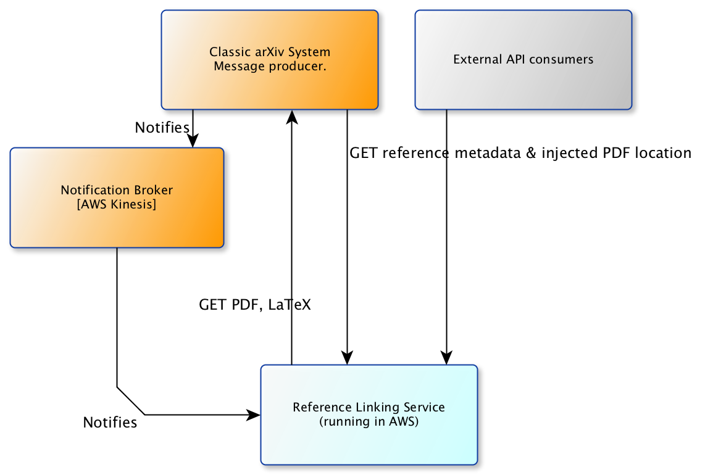
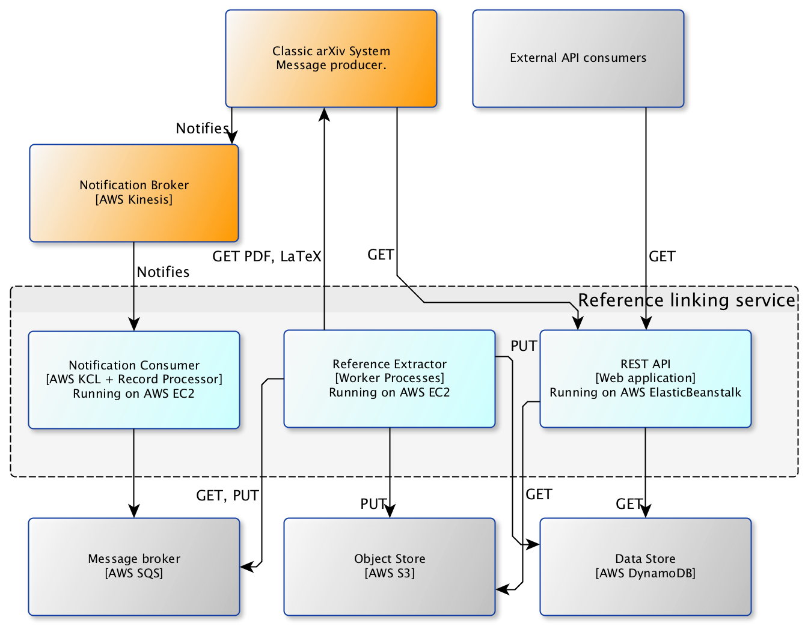

Architecture
============

This document describes the architecture of the reference linking service,
using a loose interpretation of the
[C4 architectural model](https://www.structurizr.com/help/c4).


Context
-------
The reference extraction feature is a stand-alone service deployed in
the AWS cloud environment. The legacy arXiv system will issue notifications
about new publications via a message broker. The message broker will in turn
notify the reference linking service. For each new publication, the reference
linking service will retrieve published PDFs and LaTeX source packages,
extract and parse cited references, and produce a new link-injected PDF.

The legacy arXiv system, and/or other consumers, can subsequently request
reference metadata or the location of the link-injected PDF for individual
arXiv publications via a REST API.



Subsystems
----------

Since reference extraction is time-consuming (several minutes per document),
we isolate the reference extraction process from the REST API. The reference
extraction process is responsible for processing notifications from the
notification broker, extracting and storing reference metadata, and producing
link-injected PDFs. We further isolate the notification consumption role from
the actually execution of the reference extraction steps. This results in three
independently deployable subsystems:

1. The notification agent, which receives notifications from the broker and
   generates processing tasks. This will be deployed on a dedicated EC2 virtual
   machine.
2. The reference extraction backend service (worker), which executes processing
   tasks and stores the results. Deployed as an Auto Scaling Group in EC2.
3. The REST API, which responds to client requests for reference metadata and
   link-injected PDFs. This is deployed as a WSGI web application running
   on ElasticBeanstalk.

Those second two containers have access to a shared object store (S3) and a
shared data store (DynamoDB). The REST API will only *read* from those object
stores, and the reference extraction process will only *write* to those object
stores.



Components
----------

.. image:: static/images/components.png

Notification Agent
``````````````````
Notification handling is provided by two components: a notification consumer
provided by Amazon, implemented using the Java-based Kinesis Consumer
Library, and a record processor component implemented in Python that
processes new notifications received by the consumer. A so-called
MultiLangDaemon, a stand-alone Java process, provides the glue between the
KCL and our record processor. When new notifications are received by the
consumer, the MultiLangDaemon invokes the record processor, which in turn
starts the processing pipeline. See :mod:`reflink.agent.consumer` for
details.

The :class:`reflink.agent.consumer.RecordProcessor` is responsible for
creating a new processing task for each new publication. The Celery instance
running in this container passes those requested tasks to the reference
extraction container (worker processes) via a messaging broker (such as SQS)
for execution.

Reference extraction
````````````````````
A Celery instance running on the reference extraction (worker) container
listens for new task requests coming through the messaging broker (e.g. SQS),
and coordinates the execution of those tasks. The entry point to the processing
pipeline is the :mod:`reflink.process.tasks` component, which calls a
series of functions in series for each arXiv publication.

* :mod:`reflink.process.retrieve`
* :mod:`reflink.process.extract`
* :mod:`reflink.process.merge`
* :mod:`reflink.process.store`

Access to the data store (for reference metadata) and object store (for link
injected PDFs) are provided by corresponding service components that expose a
very simple CRUD API. Those service components are used by both the reference
extraction process and the web application. See
:mod:`reflink.services.data_store`.

REST API
`````````
The REST API is provided by a web application, implemented in Flask, running
on AWS ElasticBeanstalk. This uses a fairly straightforward MVC pattern;
blueprints and view functions (:mod:`reflink.web.views`\) arbitrate client
requests and serialize responses, lightweight controllers
(:mod:`reflink.web.references`\) are responsible for interpreting request
content and retrieving relevant data from the data store;
the :mod:`reflink.services.data_store` service components provide access to
the underlying DynamoDB service.
