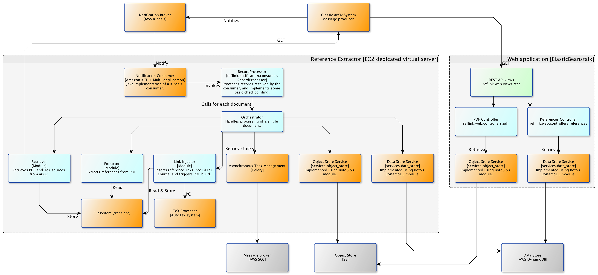

Architecture
============

This document describes the architecture of the reference extraction subsystem,
using a loose interpretation of the
[C4 architectural model](https://www.structurizr.com/help/c4).

Context
-------
The reference extraction system provides two integration options:

1. The legacy arXiv system will issue notifications about new publications via
   a message broker. The notification includes the paper ID and the location of
   a PDF. The reference extraction agent will consume those notifications and
   trigger reference extraction on those documents.
2. A client (e.g. another service) can request extraction directly by POSTing
   to the reference extraction service REST API.

The legacy arXiv system, and/or other consumers, can subsequently request
reference metadata for individual arXiv publications via the extraction REST
API.

Subsystems
----------



   Subsystem diagram for the reference extraction system.


The reference extraction system is comprised of three primary subsystems,
each deployed and scaled separately:

1. The reference extraction REST API.
#. The reference extraction worker.
#. The reference extraction agent.

In addition, there are three third-part extractor services deployed separately:

1. RefExtract. See ``refextract/Dockerfile``.
2. Cermine. See ``cermine/Dockerfile``.
3. Grobid. See ``grobid/Dockerfile``.


Extraction REST API
^^^^^^^^^^^^^^^^^^^
Described by ``Dockerfile-api``.

Handles requests for reference extraction from clients (including the reference
extraction agent), and generates extraction tasks for the reference extraction
worker. Provides access to extracted reference metadata.

Integration with the extraction worker is achieved using the `Celery
<http://www.celeryproject.org/>` distributed task queue system. A `Redis
<https://redis.io/>`_ instance acts as both the message queue and the results
backend.

Extraction requests
```````````````````
Since reference extraction is time-consuming (several minutes per document),
the actual work of extraction is performed asynchronously by a worker service.
When a POST request is received by the extraction service REST API, an
asynchronous extraction task is generated, and the API responds with the
location of a task status resource.

1. Client sends a POST request to the service endpoint (e.g.
   ``https://references.arxiv.org/references``) with a payload (e.g. a file).
2. If the upload checks out, the service initiates an asynchronous task.
3. The service responds with ``202 Accepted`` and a ``Location`` header that
   points to a task status endpoint (e.g.
   ``https://references.arxiv.org/task/<task id>``).
4. The task status endpoint responds to GET requests with the current status
   of the task. E.g. if the task ID is a Celery task UUID, the responsible
   controller uses the `AsyncResult API
   <http://docs.celeryproject.org/en/latest/reference/celery.result.html#celery.result.AsyncResult>`_
   to retrieve the task state.
5. When the task completes, the task status endpoint responds with ``303 See
   Other`` and a ``Location`` header that points to the created resource. E.g.
   ``https://references.arxiv.org/references/<document id>``

Extraction worker
^^^^^^^^^^^^^^^^^
Described by ``Dockerfile-worker``.

Does the actual work of retrieving a PDF and extracting, enhancing, and storing
cited references. Consumes tasks generated by the reference extraction API.
Calls third-party extractor services via their REST APIs.

See `this blog post
<https://blogs.cornell.edu/arxiv/2017/09/27/development-update-reference-extraction-linking/>`_
for a description of the reference validation and arbitration process.

Extraction agent
^^^^^^^^^^^^^^^^
Described by ``Dockerfile-agent``.

A Kinesis consumer that listens for notifications on the ``PDFIsAvailable``
stream. For each such notification, requests reference extraction by POSTing to
the extraction REST API.

Kinesis integration
```````````````````
Notification handling is provided by two components: a notification consumer
provided by Amazon, implemented using the Java-based Kinesis Consumer
Library, and a record processor component implemented in Python that
processes new notifications received by the consumer. A so-called
MultiLangDaemon, a stand-alone Java process, provides the glue between the
KCL and our record processor. When new notifications are received by the
consumer, the MultiLangDaemon invokes the record processor, which in turn
starts the processing pipeline handled by
:class:`references.agent.consumer.RecordProcessor`.
See :mod:`references.agent.consumer`.
